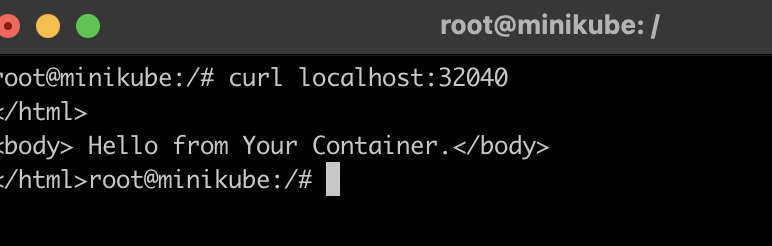
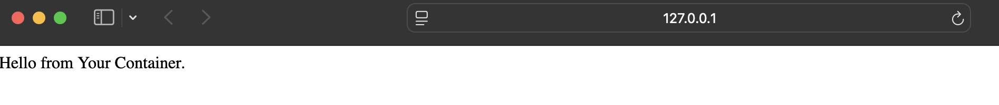

# 🚀 Kubernetes NGINX Static Site Deployment

This project demonstrates how to deploy a Dockerized static website using **NGINX** and **Kubernetes** on **Minikube**. It's part of my DevOps learning journey to master container orchestration, infrastructure-as-code, and production-grade deployments. This will eventually power educational YouTube content and act as a reference for real-world DevOps portfolios.

---

## 🛠️ Tech Stack

- ✅ Docker  
- ✅ Kubernetes (Minikube)  
- ✅ NGINX  
- ✅ YAML (K8s Manifests)  

---

## 📁 Project Structure

```
k8s-nginx-static-site/
├── k8s/
│   ├── deployment.yaml        # K8s Deployment manifest for NGINX
│   ├── service.yaml           # K8s Service (NodePort)
│   └── namespace.yaml         # Optional: Namespace definition
├── assets/
│   ├── screenshot1.png        # Preview image of deployment or app
|   └── screenshot2.png        # Preview image of deployment or app
├── .gitignore                 # Files to ignore in repo
├── README.md                  # This file
```

---

## 🚀 How to Deploy Locally with Minikube

### 1. Start Minikube
```bash
minikube start
```

### 2. Deploy Kubernetes Resources
```bash
kubectl apply -f k8s/
```

### 3. Access Your Static Site
```bash
minikube service nginx-service
```

> This will open the default browser with your deployed NGINX static site.

---

## 📦 Docker Image

```
Image: rahul0526/docker-nginx-static-site
```


---

## 🖼️ Screenshot




---

## 👤 Author

**Rahul – DevOps Engineer**  
Part of my public DevOps portfolio & content series.
